# python can GUI

基于[python-can](https://python-can.readthedocs.io/en/master/index.html)开发的一款用于can协议解析的工具。

## offline mode 

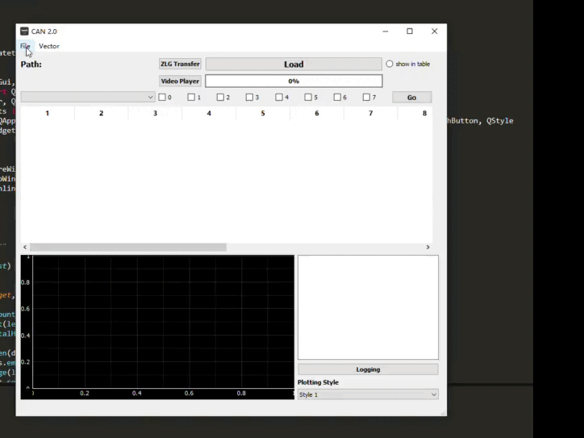

1. 运行 **CANanalysis.py** 文件:<br />
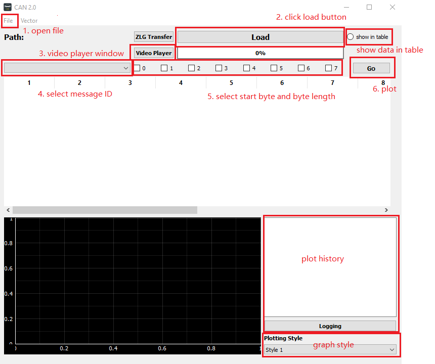
2. 运行 **video player**:<br />
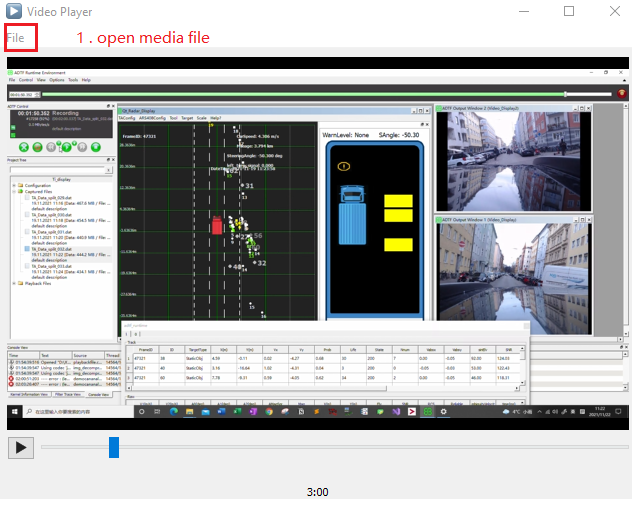

### 注意事项
1. [K-Lite Codec Pack](https://www.codecguide.com/download_k-lite_codec_pack_basic.htm) 用于 **voide player** 功能的使用, 需要预先下载才能播放视频
2. 加载的数据默认格式为**Vecotr interface**记录的**asc**文件
3. 如果想要读取**ZLG**记录的**asc**文件必须使用**ZLG Transfer**功能进行格式转化，然后再加载转化后的.asc/.dat数据

## online mode


1. 在菜单栏选择**vector->py can** 进入**online mode**<br />
2. 在**simulation**的情况下(如下图)需要设置**sender**和**receiver**的参数<br />
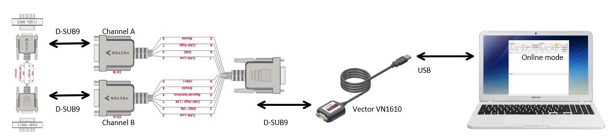
3. 当**sender**为真实的**canbus**则不需要对**sender**进行setup也不需要发送数据， **receiver**会接收数据，如果需要log请在开始接收前打开**logging**选择存储路径<br />
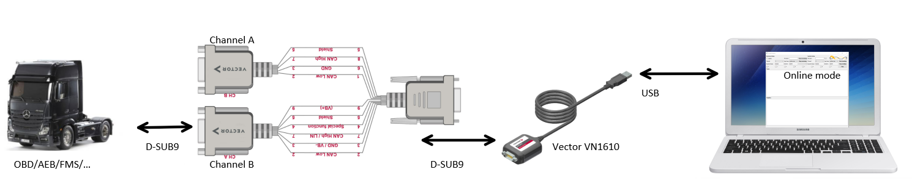<br />
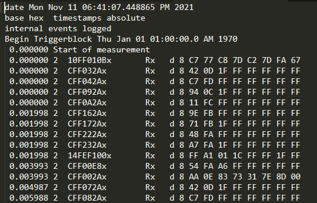
4. 想要real-time-curve需要选择**message ID**和相应的**start bit**和**bit length** 才能plot, 右键可以随时save image到本地<br />
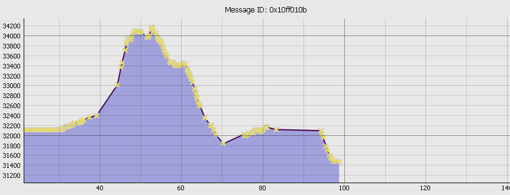


### 注意事项
1. 启动**Vector Hardware Configuration**配置 Hardware Configuration<br />
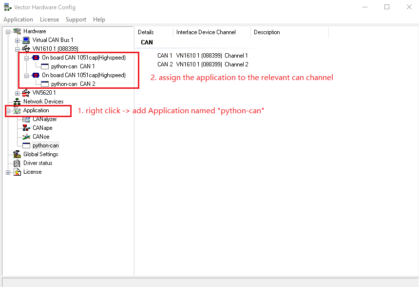
2. setup 中的 Serial Nr.(int) 需要接入设备从然后从**Vector Hardware Configuration**中读取(int类型)<br />
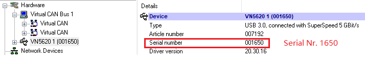
3. 主图**sender**和**receiver**的channel可能会根据Hardware不同而不同 比如VN1610 CAN Channel为[0,1]而VN5620 CAN Channel为[4,5]<br />
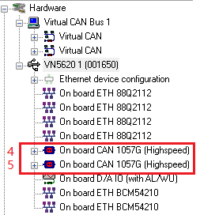 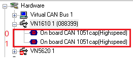
4. 下载并安装用于通用编程接口的驱动程序[XL-Driver-Library 20.30.14](https://www.vector.com/de/de/produkte/produkte-a-z/treiber-bibliotheken/xl-driver-library/)

## 生成.exe 

tutorial: https://www.youtube.com/watch?v=0KN7FfvjFFU&list=LL&index=4<br />
打开**cmd**在相应.py目录输入:
```console
pyinstaller --onefile --windowed --icon=xxx.ico .\xxx.py 
```


